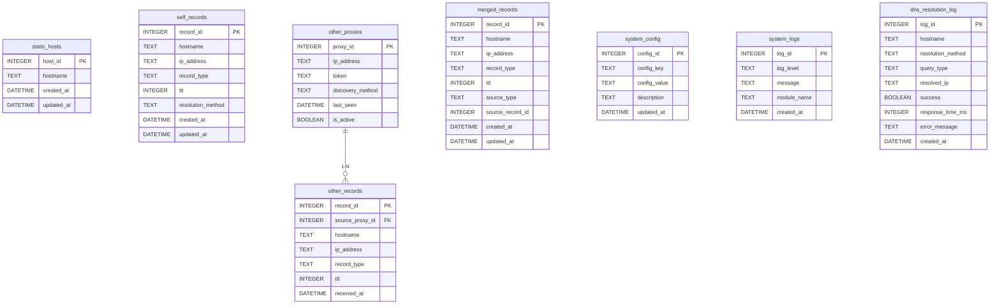

# ER図

> バージョン: 2 | 更新日時: 2026/3/21 12:22:01

mDNSプロキシシステムのER図。static_hostsで検索対象ホストを管理し、self_recordsで自身の名前解決結果（dig、Resolve-DnsName、ping、arpingなどの解決方法を記録）、other_recordsで外部プロキシからのレコード、merged_recordsでマージ済みレコード、other_proxiesで外部プロキシ情報、system_configでシステム設定、system_logsでログ、dns_resolution_logで名前解決の詳細ログを管理する

## エンティティ一覧

**STATIC_HOSTS**

| カラム名 | データ型 | キー |
| --- | --- | --- |
| host_id | INTEGER | PK |
| hostname | TEXT |  |
| created_at | DATETIME |  |
| updated_at | DATETIME |  |

**SELF_RECORDS**

| カラム名 | データ型 | キー |
| --- | --- | --- |
| record_id | INTEGER | PK |
| hostname | TEXT |  |
| ip_address | TEXT |  |
| record_type | TEXT |  |
| ttl | INTEGER |  |
| resolution_method | TEXT |  |
| created_at | DATETIME |  |
| updated_at | DATETIME |  |

**OTHER_RECORDS**

| カラム名 | データ型 | キー |
| --- | --- | --- |
| record_id | INTEGER | PK |
| source_proxy_id | INTEGER | FK |
| hostname | TEXT |  |
| ip_address | TEXT |  |
| record_type | TEXT |  |
| ttl | INTEGER |  |
| received_at | DATETIME |  |

**OTHER_PROXIES**

| カラム名 | データ型 | キー |
| --- | --- | --- |
| proxy_id | INTEGER | PK |
| ip_address | TEXT |  |
| token | TEXT |  |
| discovery_method | TEXT |  |
| last_seen | DATETIME |  |
| is_active | BOOLEAN |  |

**MERGED_RECORDS**

| カラム名 | データ型 | キー |
| --- | --- | --- |
| record_id | INTEGER | PK |
| hostname | TEXT |  |
| ip_address | TEXT |  |
| record_type | TEXT |  |
| ttl | INTEGER |  |
| source_type | TEXT |  |
| source_record_id | INTEGER |  |
| created_at | DATETIME |  |
| updated_at | DATETIME |  |

**SYSTEM_CONFIG**

| カラム名 | データ型 | キー |
| --- | --- | --- |
| config_id | INTEGER | PK |
| config_key | TEXT |  |
| config_value | TEXT |  |
| description | TEXT |  |
| updated_at | DATETIME |  |

**SYSTEM_LOGS**

| カラム名 | データ型 | キー |
| --- | --- | --- |
| log_id | INTEGER | PK |
| log_level | TEXT |  |
| message | TEXT |  |
| module_name | TEXT |  |
| created_at | DATETIME |  |

**DNS_RESOLUTION_LOG**

| カラム名 | データ型 | キー |
| --- | --- | --- |
| log_id | INTEGER | PK |
| hostname | TEXT |  |
| resolution_method | TEXT |  |
| query_type | TEXT |  |
| resolved_ip | TEXT |  |
| success | BOOLEAN |  |
| response_time_ms | INTEGER |  |
| error_message | TEXT |  |
| created_at | DATETIME |  |

## リレーション

- OTHER_PROXIES → OTHER_RECORDS (1:N)

## ER図

