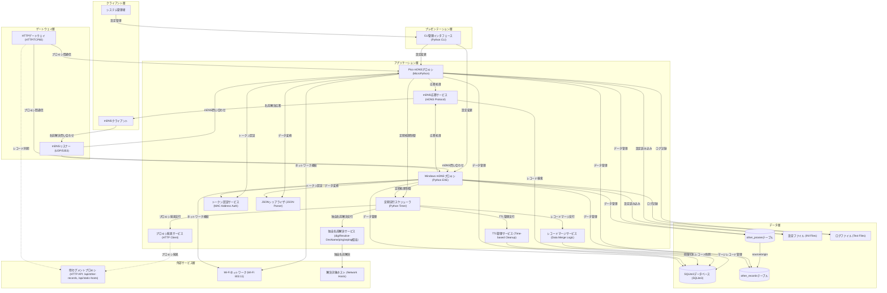

# アーキテクチャ構成図

> バージョン: 2 | 更新日時: 2026/3/21 12:37:51

分散型mDNSプロキシによるセグメント間名前解決システム（DNS依存なし独自名前解決対応）

**クライアント層:**
- システム管理者
- mDNSクライアント

**プレゼンテーション層:**
- CLI管理インタフェース [Python CLI]

**ゲートウェイ層:**
- mDNSリスナー [UDP/5353]
- HTTPゲートウェイ [HTTP/TCP80]

**アプリケーション層:**
- Pico mDNSプロキシ [MicroPython]
- Windows mDNSプロキシ [Python EXE]
- 定期実行スケジューラ [Python Timer]
- 独自名前解決サービス [dig/Resolve-DnsName/ping/arping相当]
- プロキシ発見サービス [HTTP Client]
- トークン認証サービス [MAC Address Auth]
- JSONシリアライザ [JSON Parser]
- mDNS応答サービス [mDNS Protocol]
- レコードマージサービス [Data Merge Logic]
- TTL管理サービス [Time-based Cleanup]

**データ層:**
- SQLite3データベース [SQLite3]
  - static_hosts, self_records, other_records, merged_records, other_proxies, dns_resolution_log 等を管理
- 設定ファイル [INI Files]
- ログファイル [Text Files]

**外部サービス層:**
- 他セグメントプロキシ [HTTP API: /api/other-records, /api/static-hosts 等] （※実装に合わせて仕様変更：/api/static-hostsを外部同期対象に追加）
- Wi-Fiネットワーク [Wi-Fi 802.11]
- 解決対象ホスト [Network Hosts]

**接続:**
- システム管理者 → CLI管理インタフェース (Terminal)
- mDNSクライアント → mDNSリスナー (mDNS)
- CLI管理インタフェース → Pico mDNSプロキシ (Local API)
- CLI管理インタフェース → Windows mDNSプロキシ (Local API)
- mDNSリスナー → Pico mDNSプロキシ (UDP)
- mDNSリスナー → Windows mDNSプロキシ (UDP)
- Pico mDNSプロキシ → mDNS応答サービス (Internal)
- Windows mDNSプロキシ → mDNS応答サービス (Internal)
- mDNS応答サービス → mDNSクライアント (mDNS)
- HTTPゲートウェイ → Pico mDNSプロキシ (HTTP)
- HTTPゲートウェイ → Windows mDNSプロキシ (HTTP)
- Pico mDNSプロキシ → 定期実行スケジューラ (Internal)
- Windows mDNSプロキシ → 定期実行スケジューラ (Internal)
- 定期実行スケジューラ → 独自名前解決サービス (Internal)
- 定期実行スケジューラ → プロキシ発見サービス (Internal)
- 定期実行スケジューラ → レコードマージサービス (Internal)
- 定期実行スケジューラ → TTL管理サービス (Internal)
- Pico mDNSプロキシ → トークン認証サービス (Internal)
- Windows mDNSプロキシ → トークン認証サービス (Internal)
- Pico mDNSプロキシ → JSONシリアライザ (Internal)
- Windows mDNSプロキシ → JSONシリアライザ (Internal)
- レコードマージサービス → SQLite3データベース (SQLite)
- mDNS応答サービス → SQLite3データベース (SQLite)
- TTL管理サービス → SQLite3データベース (SQLite)
- Pico mDNSプロキシ → SQLite3データベース (SQLite)
- Windows mDNSプロキシ → SQLite3データベース (SQLite)
- Pico mDNSプロキシ → 設定ファイル (File I/O)
- Windows mDNSプロキシ → 設定ファイル (File I/O)
- Pico mDNSプロキシ → ログファイル (File I/O)
- Windows mDNSプロキシ → ログファイル (File I/O)
- 独自名前解決サービス → 解決対象ホスト (dig/resolve_dns_name/ping/arping相当)
- プロキシ発見サービス → 他セグメントプロキシ (HTTP)
- HTTPゲートウェイ → 他セグメントプロキシ (HTTP)
- Pico mDNSプロキシ → Wi-Fiネットワーク (Wi-Fi)
- Windows mDNSプロキシ → Wi-Fiネットワーク (Ethernet/Wi-Fi)

