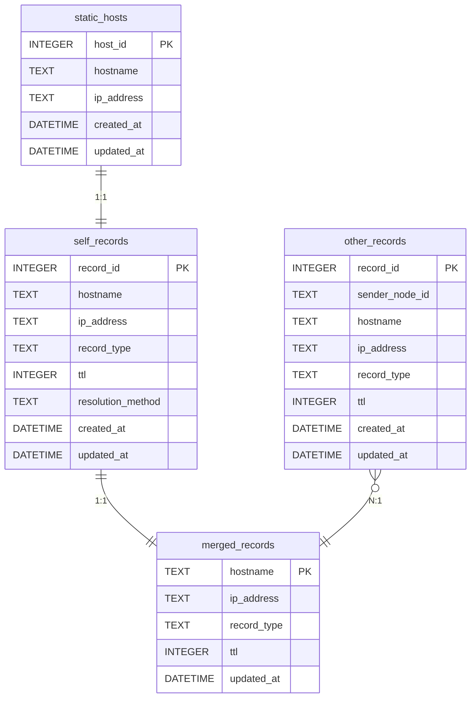

# ER図

> バージョン: 1 | 更新日時: 2026/6/9 12:38:00

静的ホスト設定(static_hosts)から自ノードでのmDNS名前解決レコード(self_records)が1対1で生成されます。自ノードレコード(self_records)と、APIを介して受信した他ノードレコード(other_records)を、hostnameをキーとしてマージ処理し、最終的な解決結果をマージ済みレコード(merged_records)として集約・保持する関係を表しています。

### エンティティ一覧

**static_hosts (静的ホスト)**

| カラム名 | データ型 | キー |
| --- | --- | --- |
| host_id | INTEGER | PK |
| hostname | TEXT |  |
| ip_address | TEXT |  |
| created_at | DATETIME |  |
| updated_at | DATETIME |  |

**self_records (自ノードレコード)**

| カラム名 | データ型 | キー |
| --- | --- | --- |
| record_id | INTEGER | PK |
| hostname | TEXT |  |
| ip_address | TEXT |  |
| record_type | TEXT |  |
| ttl | INTEGER |  |
| resolution_method | TEXT |  |
| created_at | DATETIME |  |
| updated_at | DATETIME |  |

**other_records (他ノードレコード)**

| カラム名 | データ型 | キー |
| --- | --- | --- |
| record_id | INTEGER | PK |
| sender_node_id | TEXT |  |
| hostname | TEXT |  |
| ip_address | TEXT |  |
| record_type | TEXT |  |
| ttl | INTEGER |  |
| created_at | DATETIME |  |
| updated_at | DATETIME |  |

**merged_records (マージ済みレコード)**

| カラム名 | データ型 | キー |
| --- | --- | --- |
| hostname | TEXT | PK |
| ip_address | TEXT |  |
| record_type | TEXT |  |
| ttl | INTEGER |  |
| updated_at | DATETIME |  |

### リレーション

- static_hosts (静的ホスト) → self_records (自ノードレコード) (1:1)
- self_records (自ノードレコード) → merged_records (マージ済みレコード) (1:1)
- other_records (他ノードレコード) → merged_records (マージ済みレコード) (N:1)

### ER図

