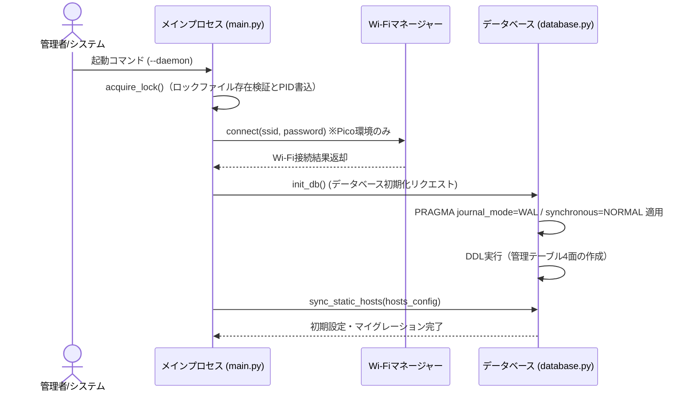
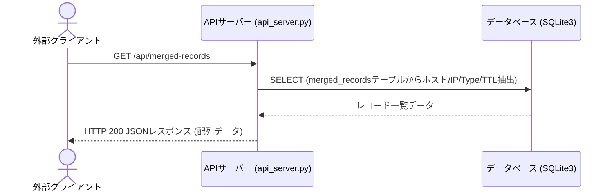
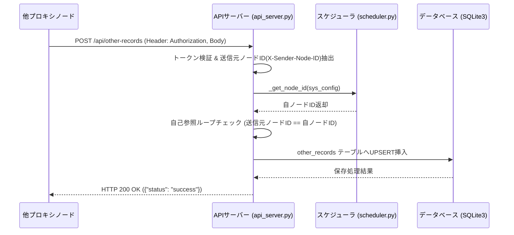
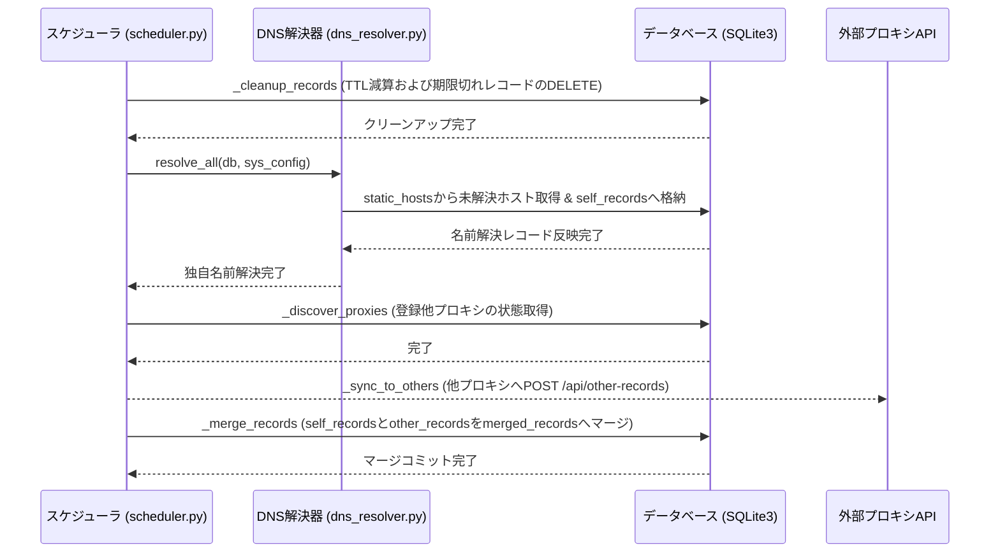
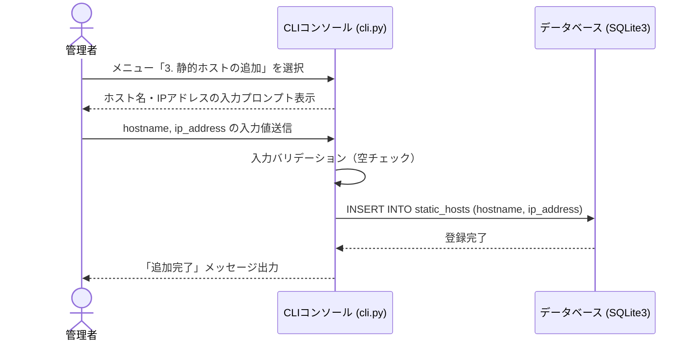

# シーケンス図

> バージョン: 1 | 更新日時: 2026/6/9 12:38:00

## 起動管理

Daemonモード起動時における、プロセスの多重起動防止（排他ロック制御）、MicroPython環境時のWi-Fi接続、SQLite3データベースの初期化（WALモード有効化）および静的ホスト設定の同期までの一連の初期化プロセス。

**参加者:** 管理者/システム (actor)、メインプロセス (main.py) (system)、Wi-Fiマネージャー (system)、データベース (database.py) (database)

**メッセージフロー:**
- 管理者/システム → メインプロセス (main.py): 起動コマンド (--daemon)
- メインプロセス (main.py) → メインプロセス (main.py): acquire_lock()（ロックファイル存在検証とPID書込）
- メインプロセス (main.py) → Wi-Fiマネージャー: connect(ssid, password) ※Pico環境のみ
  - Wi-Fiマネージャー ← メインプロセス (main.py): Wi-Fi接続結果返却
- メインプロセス (main.py) → データベース (database.py): init_db() (データベース初期化リクエスト)
- データベース (database.py) → データベース (database.py): PRAGMA journal_mode=WAL / synchronous=NORMAL 適用
- データベース (database.py) → データベース (database.py): DDL実行（管理テーブル4面の作成）
- メインプロセス (main.py) → データベース (database.py): sync_static_hosts(hosts_config)
  - データベース (database.py) ← メインプロセス (main.py): 初期設定・マイグレーション完了

## API配信

外部クライアントから『/api/merged-records』宛てに送信されたGETリクエストを処理し、最新のマージ済みレコード一覧をJSON形式で返却する。

**参加者:** 外部クライアント (actor)、APIサーバー (api_server.py) (system)、データベース (SQLite3) (database)

**メッセージフロー:**
- 外部クライアント → APIサーバー (api_server.py): GET /api/merged-records
- APIサーバー (api_server.py) → データベース (SQLite3): SELECT (merged_recordsテーブルからホスト/IP/Type/TTL抽出)
  - データベース (SQLite3) ← APIサーバー (api_server.py): レコード一覧データ
  - APIサーバー (api_server.py) ← 外部クライアント: HTTP 200 JSONレスポンス (配列データ)

## API配信

他プロキシノードから送信される同期リクエストをトークン認証、自ノード識別による自己参照ループ防止を施した上で受信し、other_recordsテーブルに格納・更新するフロー。

**参加者:** 他プロキシノード (system)、APIサーバー (api_server.py) (system)、スケジューラ (scheduler.py) (system)、データベース (SQLite3) (database)

**メッセージフロー:**
- 他プロキシノード → APIサーバー (api_server.py): POST /api/other-records (Header: Authorization, Body)
- APIサーバー (api_server.py) → APIサーバー (api_server.py): トークン検証 & 送信元ノードID(X-Sender-Node-ID)抽出
- APIサーバー (api_server.py) → スケジューラ (scheduler.py): _get_node_id(sys_config)
  - スケジューラ (scheduler.py) ← APIサーバー (api_server.py): 自ノードID返却
- APIサーバー (api_server.py) → APIサーバー (api_server.py): 自己参照ループチェック (送信元ノードID == 自ノードID)
- APIサーバー (api_server.py) → データベース (SQLite3): other_records テーブルへUPSERT挿入
  - データベース (SQLite3) ← APIサーバー (api_server.py): 保存処理結果
  - APIサーバー (api_server.py) ← 他プロキシノード: HTTP 200 OK ({"status": "success"})

## 常駐処理

Daemonモード内でバックグラウンド動作する常駐スケジューラが、一定周期でTTLの減算・レコードのクリーンアップ、静的ホストの名前解決、プロキシ相互発見、中継同期送信、および最終的なレコードマージを一連の順序でバッチ実行するフロー。

**参加者:** スケジューラ (scheduler.py) (system)、DNS解決器 (dns_resolver.py) (system)、データベース (SQLite3) (database)、外部プロキシAPI (system)

**メッセージフロー:**
- スケジューラ (scheduler.py) → データベース (SQLite3): _cleanup_records (TTL減算および期限切れレコードのDELETE)
  - データベース (SQLite3) ← スケジューラ (scheduler.py): クリーンアップ完了
- スケジューラ (scheduler.py) → DNS解決器 (dns_resolver.py): resolve_all(db, sys_config)
- DNS解決器 (dns_resolver.py) → データベース (SQLite3): static_hostsから未解決ホスト取得 & self_recordsへ格納
  - データベース (SQLite3) ← DNS解決器 (dns_resolver.py): 名前解決レコード反映完了
  - DNS解決器 (dns_resolver.py) ← スケジューラ (scheduler.py): 独自名前解決完了
- スケジューラ (scheduler.py) → データベース (SQLite3): _discover_proxies (登録他プロキシの状態取得)
  - データベース (SQLite3) ← スケジューラ (scheduler.py): 完了
- スケジューラ (scheduler.py) → 外部プロキシAPI: _sync_to_others (他プロキシへPOST /api/other-records)
- スケジューラ (scheduler.py) → データベース (SQLite3): _merge_records (self_recordsとother_recordsをmerged_recordsへマージ)
  - データベース (SQLite3) ← スケジューラ (scheduler.py): マージコミット完了

## 管理者ツール

管理者がCLIを通じて新規の静的解決ホスト情報を手動で定義し、データベースの static_hosts テーブルへ登録する処理フロー。

**参加者:** 管理者 (actor)、CLIコンソール (cli.py) (system)、データベース (SQLite3) (database)

**メッセージフロー:**
- 管理者 → CLIコンソール (cli.py): メニュー「3. 静的ホストの追加」を選択
  - CLIコンソール (cli.py) ← 管理者: ホスト名・IPアドレスの入力プロンプト表示
- 管理者 → CLIコンソール (cli.py): hostname, ip_address の入力値送信
- CLIコンソール (cli.py) → CLIコンソール (cli.py): 入力バリデーション（空チェック）
- CLIコンソール (cli.py) → データベース (SQLite3): INSERT INTO static_hosts (hostname, ip_address)
  - データベース (SQLite3) ← CLIコンソール (cli.py): 登録完了
  - CLIコンソール (cli.py) ← 管理者: 「追加完了」メッセージ出力

