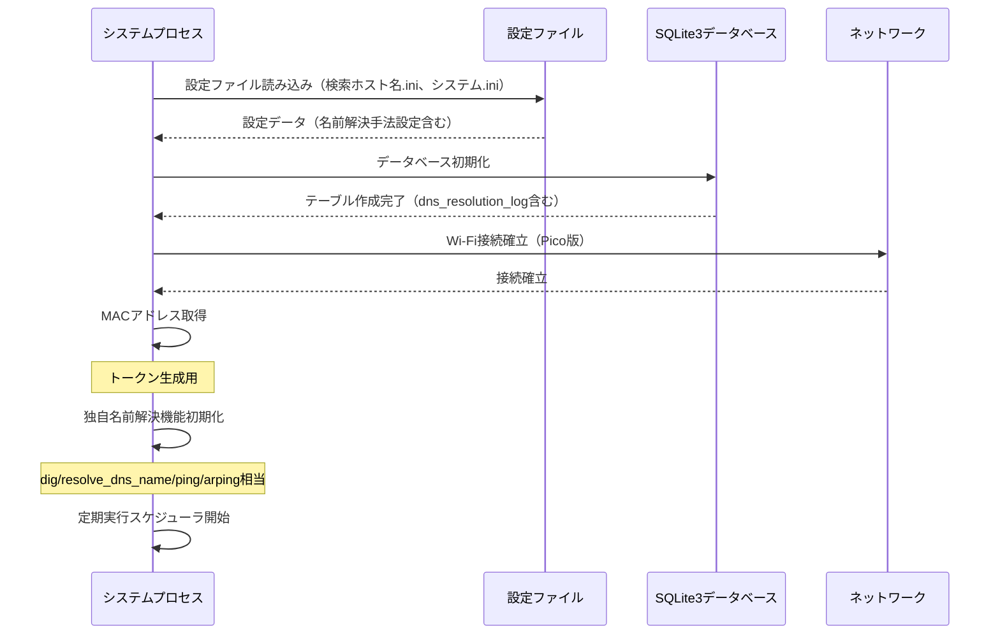
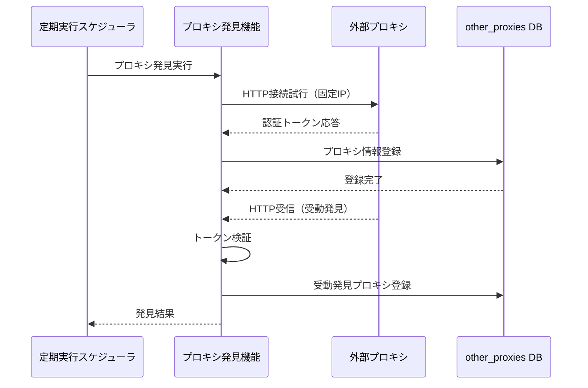
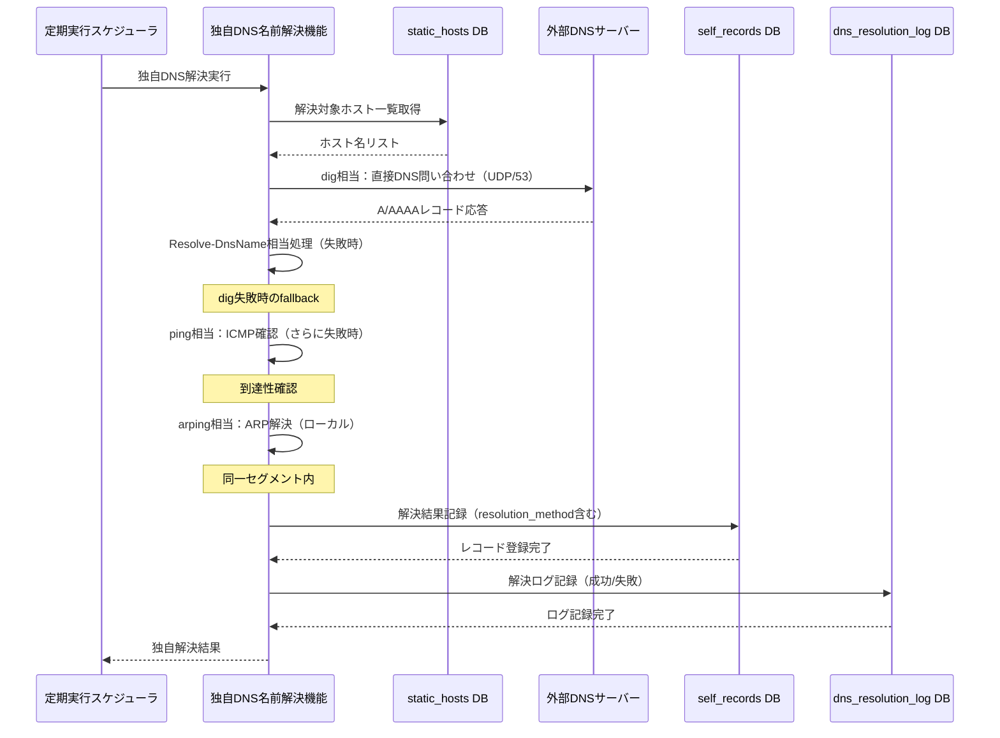
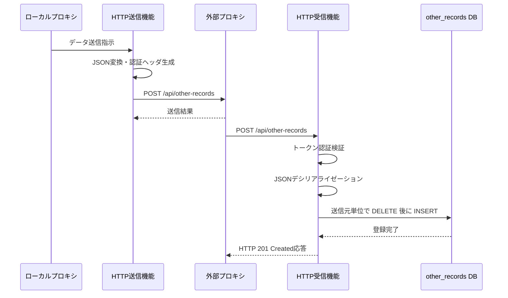
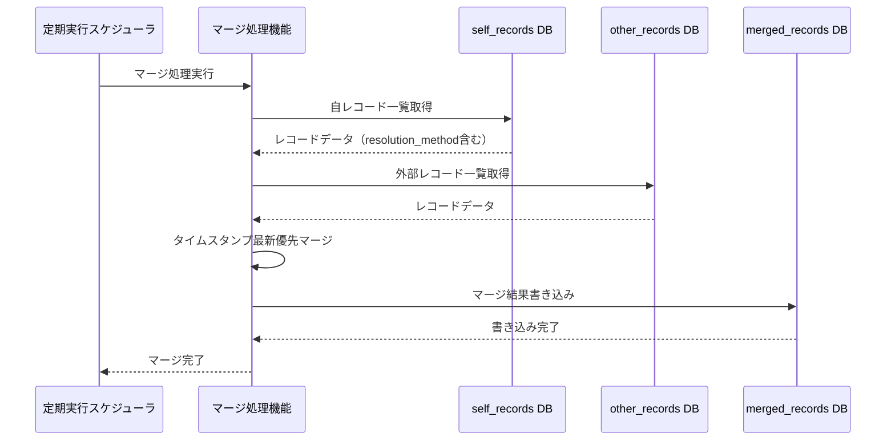
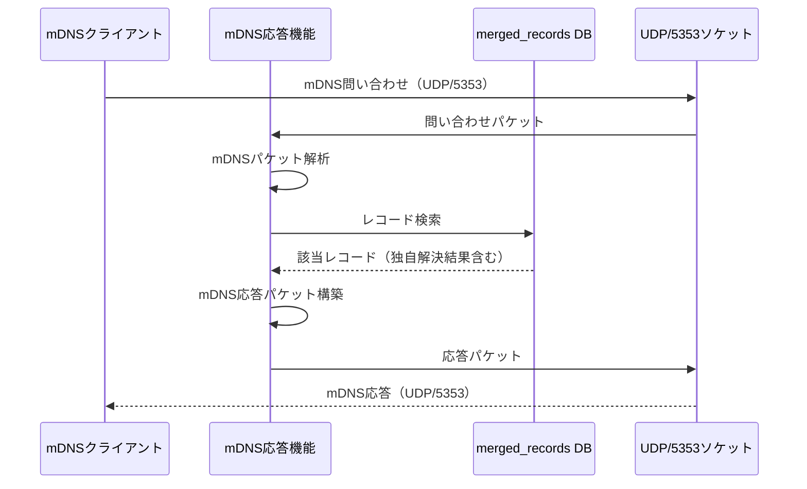
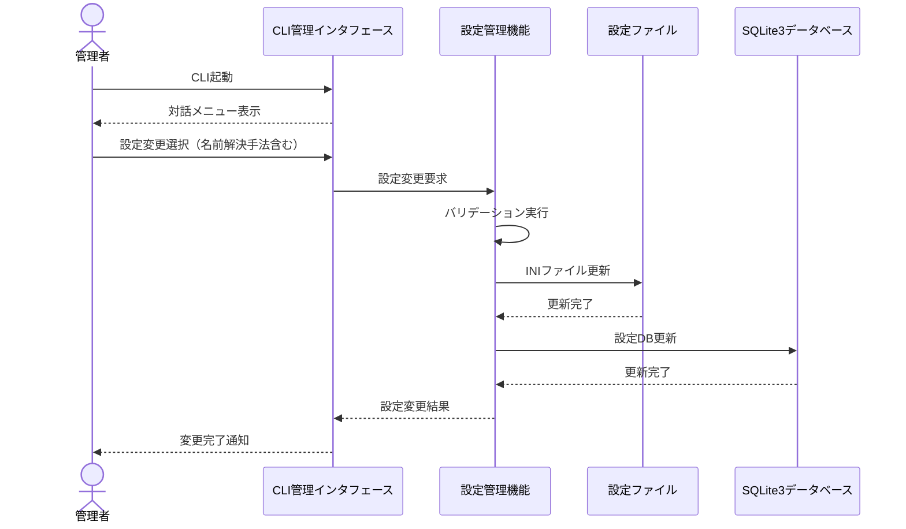
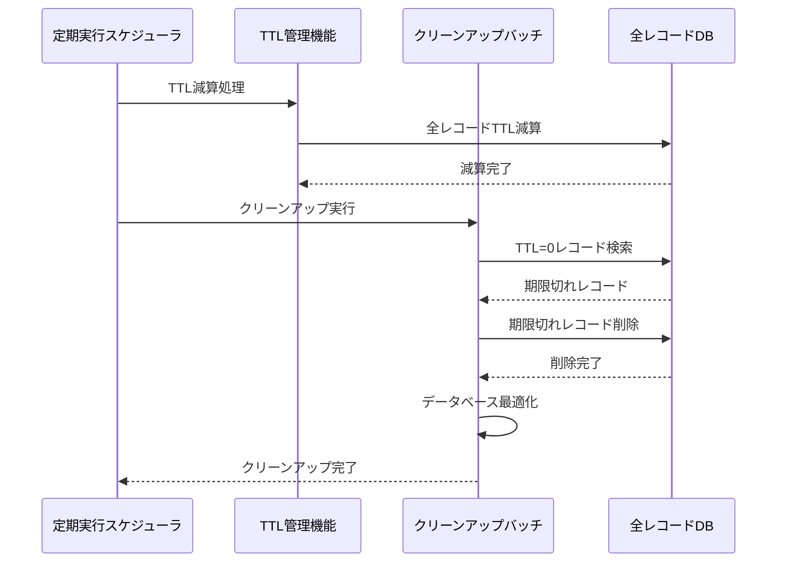
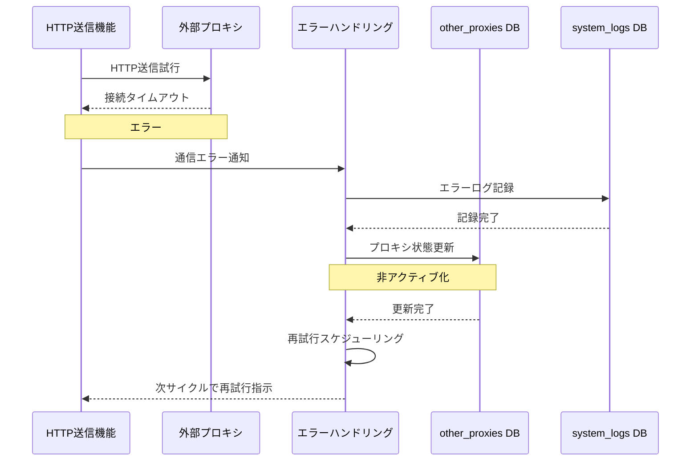
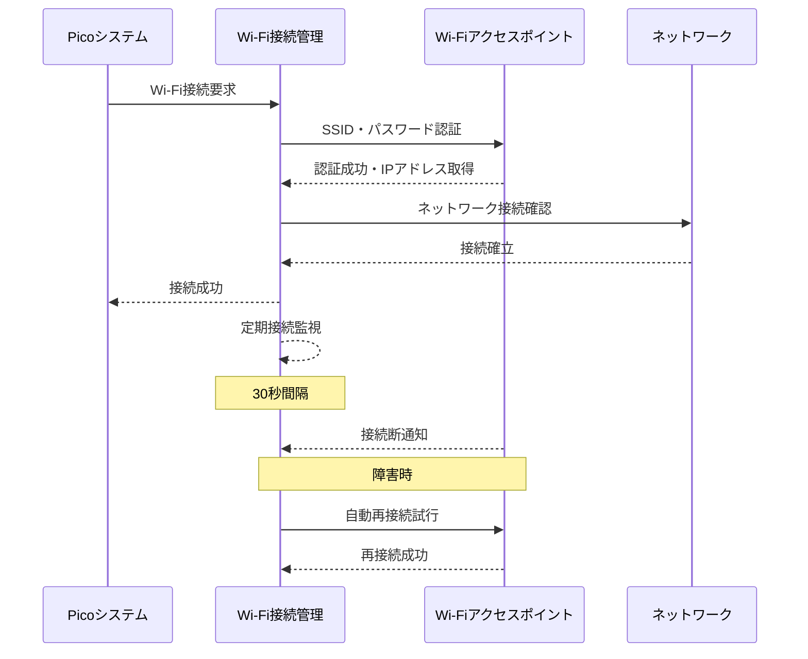

# シーケンス図

> バージョン: 2 | 更新日時: 2026/3/21 12:37:27

## システム初期化フロー

システム起動時の設定ファイル読み込み、データベース初期化、基本設定の確立。名前解決は自プロキシ内で独自実装

**参加者:** システムプロセス (system)、設定ファイル (database)、SQLite3データベース (database)、ネットワーク (external)

**メッセージフロー:**
- システムプロセス → 設定ファイル: 設定ファイル読み込み（検索ホスト名.ini、システム.ini）
  - 設定ファイル ← システムプロセス: 設定データ（名前解決手法設定含む）
- システムプロセス → SQLite3データベース: データベース初期化
  - SQLite3データベース ← システムプロセス: テーブル作成完了（dns_resolution_log含む）
- システムプロセス → ネットワーク: Wi-Fi接続確立（Pico版）
  - ネットワーク ← システムプロセス: 接続確立
- システムプロセス → システムプロセス: MACアドレス取得
- システムプロセス → システムプロセス: 独自名前解決機能初期化
- システムプロセス → システムプロセス: 定期実行スケジューラ開始

## プロキシ発見フロー

固定IPリストスキャンとトークン受動発見による外部プロキシの自動発見

**参加者:** 定期実行スケジューラ (system)、プロキシ発見機能 (system)、外部プロキシ (external)、other_proxies DB (database)

**メッセージフロー:**
- 定期実行スケジューラ → プロキシ発見機能: プロキシ発見実行
- プロキシ発見機能 → 外部プロキシ: HTTP接続試行（固定IP）
  - 外部プロキシ ← プロキシ発見機能: 認証トークン応答
- プロキシ発見機能 → other_proxies DB: プロキシ情報登録
  - other_proxies DB ← プロキシ発見機能: 登録完了
- 外部プロキシ → プロキシ発見機能: HTTP受信（受動発見）
- プロキシ発見機能 → プロキシ発見機能: トークン検証
- プロキシ発見機能 → other_proxies DB: 受動発見プロキシ登録
  - プロキシ発見機能 ← 定期実行スケジューラ: 発見結果

## 独自DNS名前解決フロー

static_DBのホスト名について、dig・Resolve-DnsName・ping・arpingコマンド相当の独自処理で正引きを実行

**参加者:** 定期実行スケジューラ (system)、独自DNS名前解決機能 (system)、static_hosts DB (database)、外部DNSサーバー (external)、self_records DB (database)、dns_resolution_log DB (database)

**メッセージフロー:**
- 定期実行スケジューラ → 独自DNS名前解決機能: 独自DNS解決実行
- 独自DNS名前解決機能 → static_hosts DB: 解決対象ホスト一覧取得
  - static_hosts DB ← 独自DNS名前解決機能: ホスト名リスト
- 独自DNS名前解決機能 → 外部DNSサーバー: dig相当：直接DNS問い合わせ（UDP/53）
  - 外部DNSサーバー ← 独自DNS名前解決機能: A/AAAAレコード応答
- 独自DNS名前解決機能 → 独自DNS名前解決機能: Resolve-DnsName相当処理（失敗時）
- 独自DNS名前解決機能 → 独自DNS名前解決機能: ping相当：ICMP確認（さらに失敗時）
- 独自DNS名前解決機能 → 独自DNS名前解決機能: arping相当：ARP解決（ローカル）
- 独自DNS名前解決機能 → self_records DB: 解決結果記録（resolution_method含む）
  - self_records DB ← 独自DNS名前解決機能: レコード登録完了
- 独自DNS名前解決機能 → dns_resolution_log DB: 解決ログ記録（成功/失敗）
  - dns_resolution_log DB ← 独自DNS名前解決機能: ログ記録完了
  - 独自DNS名前解決機能 ← 定期実行スケジューラ: 独自解決結果

## プロキシ間データ同期フロー

外部プロキシとのHTTP通信による双方向データ同期処理

**参加者:** ローカルプロキシ (system)、HTTP送信機能 (system)、外部プロキシ (external)、HTTP受信機能 (system)、other_records DB (database)

**メッセージフロー:**
- ローカルプロキシ → HTTP送信機能: データ送信指示
- HTTP送信機能 → HTTP送信機能: JSON変換・認証ヘッダ生成
- HTTP送信機能 → 外部プロキシ: POST /api/other-records
  - 外部プロキシ ← HTTP送信機能: 送信結果
- 外部プロキシ → HTTP受信機能: POST /api/other-records
- HTTP受信機能 → HTTP受信機能: トークン認証検証
- HTTP受信機能 → HTTP受信機能: JSONデシリアライゼーション
- HTTP受信機能 → other_records DB: 送信元単位で DELETE 後に INSERT
  - other_records DB ← HTTP受信機能: 登録完了
  - HTTP受信機能 ← 外部プロキシ: HTTP 201 Created応答

## データマージフロー

self_DBとother_DBをタイムスタンプ最新優先でマージしてmerged_DB作成

**参加者:** 定期実行スケジューラ (system)、マージ処理機能 (system)、self_records DB (database)、other_records DB (database)、merged_records DB (database)

**メッセージフロー:**
- 定期実行スケジューラ → マージ処理機能: マージ処理実行
- マージ処理機能 → self_records DB: 自レコード一覧取得
  - self_records DB ← マージ処理機能: レコードデータ（resolution_method含む）
- マージ処理機能 → other_records DB: 外部レコード一覧取得
  - other_records DB ← マージ処理機能: レコードデータ
- マージ処理機能 → マージ処理機能: タイムスタンプ最新優先マージ
- マージ処理機能 → merged_records DB: マージ結果書き込み
  - merged_records DB ← マージ処理機能: 書き込み完了
  - マージ処理機能 ← 定期実行スケジューラ: マージ完了

## mDNS応答フロー

UDP/5353でmDNS問い合わせを受信し、merged_DBから検索して応答送信

**参加者:** mDNSクライアント (external)、mDNS応答機能 (system)、merged_records DB (database)、UDP/5353ソケット (system)

**メッセージフロー:**
- mDNSクライアント → UDP/5353ソケット: mDNS問い合わせ（UDP/5353）
- UDP/5353ソケット → mDNS応答機能: 問い合わせパケット
- mDNS応答機能 → mDNS応答機能: mDNSパケット解析
- mDNS応答機能 → merged_records DB: レコード検索
  - merged_records DB ← mDNS応答機能: 該当レコード（独自解決結果含む）
- mDNS応答機能 → mDNS応答機能: mDNS応答パケット構築
- mDNS応答機能 → UDP/5353ソケット: 応答パケット
  - UDP/5353ソケット ← mDNSクライアント: mDNS応答（UDP/5353）

## CLI管理インタフェースフロー

対話メニュー形式でのシステム設定変更と状態確認

**参加者:** 管理者 (actor)、CLI管理インタフェース (system)、設定管理機能 (system)、設定ファイル (database)、SQLite3データベース (database)

**メッセージフロー:**
- 管理者 → CLI管理インタフェース: CLI起動
  - CLI管理インタフェース ← 管理者: 対話メニュー表示
- 管理者 → CLI管理インタフェース: 設定変更選択（名前解決手法含む）
- CLI管理インタフェース → 設定管理機能: 設定変更要求
- 設定管理機能 → 設定管理機能: バリデーション実行
- 設定管理機能 → 設定ファイル: INIファイル更新
  - 設定ファイル ← 設定管理機能: 更新完了
- 設定管理機能 → SQLite3データベース: 設定DB更新
  - SQLite3データベース ← 設定管理機能: 更新完了
  - 設定管理機能 ← CLI管理インタフェース: 設定変更結果
  - CLI管理インタフェース ← 管理者: 変更完了通知

## TTL管理・クリーンアップフロー

定期実行でTTL管理と期限切れレコードの削除処理

**参加者:** 定期実行スケジューラ (system)、TTL管理機能 (system)、クリーンアップバッチ (system)、全レコードDB (database)

**メッセージフロー:**
- 定期実行スケジューラ → TTL管理機能: TTL減算処理
- TTL管理機能 → 全レコードDB: 全レコードTTL減算
  - 全レコードDB ← TTL管理機能: 減算完了
- 定期実行スケジューラ → クリーンアップバッチ: クリーンアップ実行
- クリーンアップバッチ → 全レコードDB: TTL=0レコード検索
  - 全レコードDB ← クリーンアップバッチ: 期限切れレコード
- クリーンアップバッチ → 全レコードDB: 期限切れレコード削除
  - 全レコードDB ← クリーンアップバッチ: 削除完了
- クリーンアップバッチ → クリーンアップバッチ: データベース最適化
  - クリーンアップバッチ ← 定期実行スケジューラ: クリーンアップ完了

## エラーハンドリング・復旧フロー

外部プロキシ接続失敗時のスキップ処理と再試行制御

**参加者:** HTTP送信機能 (system)、外部プロキシ (external)、エラーハンドリング (system)、other_proxies DB (database)、system_logs DB (database)

**メッセージフロー:**
- HTTP送信機能 → 外部プロキシ: HTTP送信試行
  - 外部プロキシ ← HTTP送信機能: 接続タイムアウト
- HTTP送信機能 → エラーハンドリング: 通信エラー通知
- エラーハンドリング → system_logs DB: エラーログ記録
  - system_logs DB ← エラーハンドリング: 記録完了
- エラーハンドリング → other_proxies DB: プロキシ状態更新
  - other_proxies DB ← エラーハンドリング: 更新完了
- エラーハンドリング → エラーハンドリング: 再試行スケジューリング
  - エラーハンドリング ← HTTP送信機能: 次サイクルで再試行指示

## Wi-Fi接続管理フロー

Pico版でのWi-Fi接続確立、監視、自動再接続処理

**参加者:** Picoシステム (system)、Wi-Fi接続管理 (system)、Wi-Fiアクセスポイント (external)、ネットワーク (external)

**メッセージフロー:**
- Picoシステム → Wi-Fi接続管理: Wi-Fi接続要求
- Wi-Fi接続管理 → Wi-Fiアクセスポイント: SSID・パスワード認証
  - Wi-Fiアクセスポイント ← Wi-Fi接続管理: 認証成功・IPアドレス取得
- Wi-Fi接続管理 → ネットワーク: ネットワーク接続確認
  - ネットワーク ← Wi-Fi接続管理: 接続確立
  - Wi-Fi接続管理 ← Picoシステム: 接続成功
- Wi-Fi接続管理 → Wi-Fi接続管理: 定期接続監視
- Wi-Fiアクセスポイント → Wi-Fi接続管理: 接続断通知
- Wi-Fi接続管理 → Wi-Fiアクセスポイント: 自動再接続試行
  - Wi-Fiアクセスポイント ← Wi-Fi接続管理: 再接続成功

