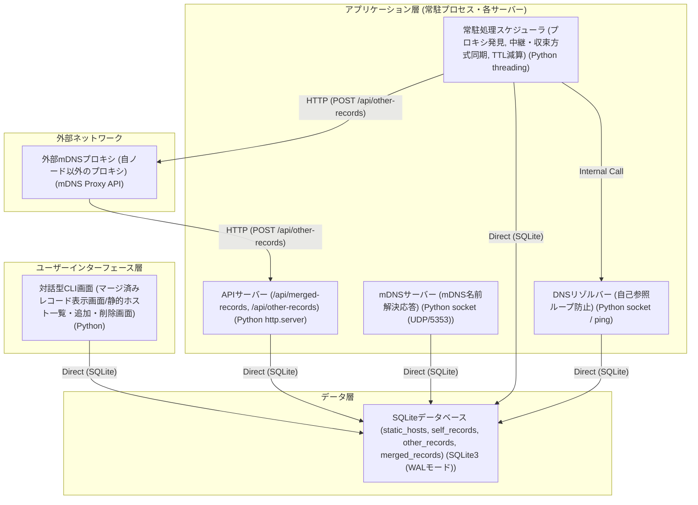

# アーキテクチャ構成図

> バージョン: 1 | 更新日時: 2026/6/9 12:38:00

ネットワークセグメントを跨いだmDNS名前解決を実現する分散型プロキシシステム。常駐処理、二重起動を防ぐ排他制御、中継・収束方式による他プロキシとのレコード同期、自己参照ループを防止した独自DNS名前解決を特徴とします。

**ユーザーインターフェース層:**
- 対話型CLI画面 (マージ済みレコード表示画面/静的ホスト一覧・追加・削除画面) [Python]

**アプリケーション層 (常駐プロセス・各サーバー):**
- APIサーバー (/api/merged-records, /api/other-records) [Python http.server]
- mDNSサーバー (mDNS名前解決応答) [Python socket (UDP/5353)]
- 常駐処理スケジューラ (プロキシ発見, 中継・収束方式同期, TTL減算) [Python threading]
- DNSリゾルバー (自己参照ループ防止) [Python socket / ping]

**データ層:**
- SQLiteデータベース (static_hosts, self_records, other_records, merged_records) [SQLite3 (WALモード)]

**外部ネットワーク:**
- 外部mDNSプロキシ (自ノード以外のプロキシ) [mDNS Proxy API]

**接続:**
- 対話型CLI画面 (マージ済みレコード表示画面/静的ホスト一覧・追加・削除画面) → SQLiteデータベース (static_hosts, self_records, other_records, merged_records) (Direct (SQLite))
- APIサーバー (/api/merged-records, /api/other-records) → SQLiteデータベース (static_hosts, self_records, other_records, merged_records) (Direct (SQLite))
- mDNSサーバー (mDNS名前解決応答) → SQLiteデータベース (static_hosts, self_records, other_records, merged_records) (Direct (SQLite))
- 常駐処理スケジューラ (プロキシ発見, 中継・収束方式同期, TTL減算) → SQLiteデータベース (static_hosts, self_records, other_records, merged_records) (Direct (SQLite))
- 常駐処理スケジューラ (プロキシ発見, 中継・収束方式同期, TTL減算) → DNSリゾルバー (自己参照ループ防止) (Internal Call)
- DNSリゾルバー (自己参照ループ防止) → SQLiteデータベース (static_hosts, self_records, other_records, merged_records) (Direct (SQLite))
- 常駐処理スケジューラ (プロキシ発見, 中継・収束方式同期, TTL減算) → 外部mDNSプロキシ (自ノード以外のプロキシ) (HTTP (POST /api/other-records))
- 外部mDNSプロキシ (自ノード以外のプロキシ) → APIサーバー (/api/merged-records, /api/other-records) (HTTP (POST /api/other-records))

